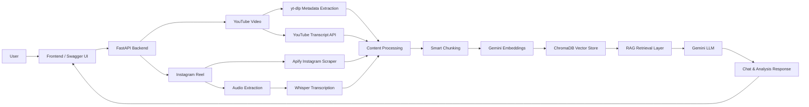

# CreatorJoy RAG Chatbot

AI-powered RAG chatbot for comparing creator videos using transcript embeddings and vector search.

## What this project does

This project takes two social media video URLs (YouTube / Instagram), extracts transcripts + metadata, stores embeddings in a vector database, and allows users to chat with the content using a RAG pipeline.

The goal is to help creators understand why one video performed better than another.

---

## Features

- YouTube + Instagram video processing
- Transcript extraction
- Metadata analysis
- Engagement rate calculation
- ChromaDB vector storage
- LangChain-based RAG chatbot
- Gemini-powered responses
- Session memory support

---

## Tech Stack

### Backend
- FastAPI
- LangChain
- ChromaDB
- Gemini API
- Python

### Frontend (planned)
- Next.js
- TailwindCSS

---

## Current Progress

- Backend APIs setup
- Vector embedding pipeline integrated
- Gemini integration completed
- Basic transcript extraction working
- Frontend not started yet

---

##  System Architecture



### Processing Flow

1. User submits YouTube or Instagram video URLs.
2. The backend extracts available metadata such as title, creator, views, likes, comments, hashtags, and duration.
3. Video transcripts are collected:

   * YouTube videos use the YouTube Transcript API.
   * Instagram reels use Whisper-based speech transcription.
4. Transcript content is cleaned and divided into semantic chunks.
5. Gemini Embeddings converts chunks into vector representations.
6. ChromaDB stores and retrieves relevant chunks during conversations.
7. A Retrieval-Augmented Generation (RAG) pipeline supplies relevant context to Gemini.
8. Gemini generates answers, summaries, and insights grounded in the video content.

```
```
