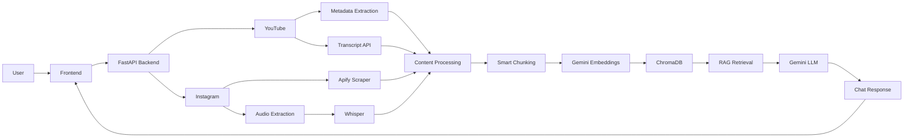

# CreatorJoy RAG Chatbot

AI-powered RAG chatbot for analyzing creator videos using transcript embeddings, vector search, and conversational retrieval.

## What This Project Does

CreatorJoy allows users to submit YouTube videos and Instagram Reels, extract their content and metadata, store embeddings in a vector database, and interact with the videos through a Retrieval-Augmented Generation (RAG) chatbot.

The goal is to help creators understand video content, engagement patterns, and audience interaction through AI-powered analysis.

---

## Features

* YouTube video processing
* Instagram Reel processing
* Transcript extraction
* Whisper-based audio transcription
* Metadata extraction
* Engagement rate calculation
* Semantic chunking
* Gemini embeddings
* ChromaDB vector storage
* RAG-powered chatbot
* Streaming AI responses
* Session-based memory

---

## Tech Stack

### Backend

* FastAPI
* Python
* LangChain
* ChromaDB
* Google Gemini
* Whisper
* yt-dlp
* Apify

### Frontend (In Progress)

* Next.js
* TypeScript
* Tailwind CSS

---

## Current Progress

### Completed

* FastAPI backend setup
* Gemini integration
* ChromaDB vector storage
* YouTube transcript extraction
* Instagram Reel metadata extraction
* Instagram audio transcription using Whisper
* RAG chat pipeline
* Streaming responses

### In Progress

* Frontend dashboard
* Enhanced analytics and insights
* Video comparison UI

---

## System Architecture



## Processing Flow

1. Users submit YouTube videos or Instagram Reel URLs.
2. Metadata such as title, creator, views, likes, comments, hashtags, and duration is extracted.
3. Transcript content is collected:

   * YouTube videos use the YouTube Transcript API.
   * Instagram Reels use Whisper after audio extraction.
4. Content is cleaned and divided into semantic chunks.
5. Gemini Embeddings converts chunks into vector representations.
6. ChromaDB stores embeddings for semantic retrieval.
7. Relevant chunks are retrieved through the RAG pipeline.
8. Gemini generates context-aware responses grounded in video content.
9. Responses are streamed back to the user.

---

## Run Backend

```bash
cd backend

pip install -r requirements.txt

python run.py
```

---

## API Documentation

After starting the server:

```text
http://localhost:8000/docs
```

Swagger UI can be used to test all endpoints.

---

## Future Improvements

* Advanced creator analytics
* Video-to-video comparison insights
* Trend detection
* Audience sentiment analysis
* Thumbnail analysis
* Multi-video knowledge base
* Production deployment

```
```
